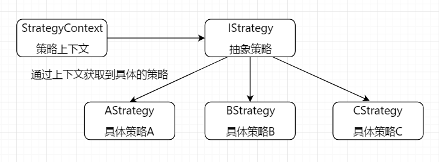
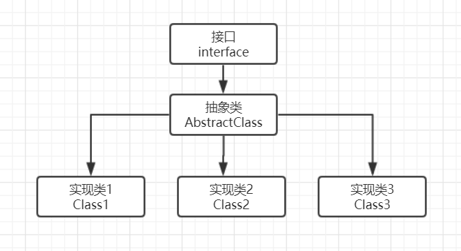

# design patterns

## TODO

### 六大设计原则
### 创建型模式
 - [X] 简单工厂模式
 - [X] 工厂方法模式
 - [X] 抽象工厂模式
 - [X] 建造者模式
 - [X] 原型模式
 - [X] 单例模式
### 行为型模式
 - [X] 责任链模式 —— 以讹传讹
 - [ ] 命令模式
 - [ ] 解释器模式
 - [ ] 迭代器模式
 - [ ] 中介者模式
 - [ ] 备忘录模式
 - [ ] 观察者模式
 - [ ] 状态模式
 - [X] 策略模式 —— 随机应变
 - [X] 模板方法模式
 - [ ] 访问者模式
 - [X] 代理模式 —— 托孤寄命
### 结构型模式
 - [X] 适配器模式
 - [X] 桥接模式
 - [X] 组合模式
 - [ ] 装饰模式
 - [ ] 外观模式
 - [ ] 享元模式
 - [ ] 代理模式
### J2EE 模式
 - [ ] MVC 模式
 - [ ] 业务代表模式
 - [ ] 传输对象模式
 - [ ] 数据访问对象模式
 - [ ] 前端控制器模式
 - [ ] 拦截过滤器模式
 - [ ] 服务定位器模式

## 六大设计原则

* 单一职责原则
  * 一个类只负责一个功能领域中的相应职责，就一个类而言，应该只有一个引起它变化的原因
  * 是实现高内聚、低耦合的指导方针
  * 解释：
     * 高内聚
       * 尽可能类的每个成员方法只完成一件事（最大限度的聚合）
       * 模块内部的代码， 相互之间的联系越强，内聚就越高， 模块的独立性就越好 
     * 低耦合: 减少类内部，一个成员方法调用另一个成员方法, 不要有牵一发动全身

* 开闭原则
  * 对扩展开放，对修改关闭，在程序需要进行拓展的时候，不能去修改原有的代码，实现一个热插拔的效果
 
* 里氏替换原则LSP
  * 任何基类可以出现的地方，子类一定可以出现
  * 在程序中尽量使用基类类型来对对象进行定义，而在运行时再确定其子类类型，用子类对象来替换父类对象
  * controller->service->dao
  
* 依赖倒转原则
  * 是开闭原则的基础，针对接口编程，依赖于抽象而不依赖于具体
  * 高层模块不应该依赖低层模块，二者都应该依赖其抽象
    
* 接口隔离原则
  * 客户端不应该依赖那些它不需要的接口
  * 使用多个隔离的接口，比使用单个接口要好，降低类之间的耦合度
  
* 迪米特法则
  * 最少知道原则，一个实体应当尽量少地与其他实体之间发生相互作用，使得系统功能模块相对独立
  * 类之间的耦合度越低，就越有利于复用，一个处在松耦合中的类一旦被修改，不会对关联的类造成太大波及
  * 通过引入一个合理的第三者来降低现有对象之间的耦合度

## GOF (Gang of Four)

> 在 1994 年，由 四位作者合称 GOF（全拼 Gang of Four）四人合著出版了一本名为 Design Patterns - Elements of Reusable Object-Oriented Software. 他们所提出的设计模式主要是基于以下的面向对象设计原则。
> 1). 对接口编程而不是对实现编程
> 2). 优先使用对象组合而不是继承

## 设计模式分类

设计模式总共有 23 种，总体来说可以分为三大类：创建型模式（ Creational Patterns ）、结构型模式（ Structural Patterns ）和行为型模式（ Behavioral Patterns ）。

| 分类 | 关注点 | 包含 |
| -- | -- | -- |
| 创建型模式 | 关注于对象的创建，同时隐藏创建逻辑 | 工厂模式、抽象工厂模式、单例模式、建造者模式； 不常用：原型模式 |
| 结构型模式 | 关注类和对象之间的组合 | 适配器模式、过滤器模式、装饰模式、代理模式、桥接模式；不常用：组合模式，外观模式，享元模式 |
| 行为型模式 | 关注对象之间的通信 | 责任链模式、观察者模式、状态模式、策略模式、模板模式、空对象模式、迭代器模式；不常用：备忘录模式，命令模式；几乎不用：访问者模式，中介者模式，解释器模式 |

## 单例设计模式

### 是什么

* 单例意思是只包含一个对象被称为单例的特殊类
* 通过单例模式可以保证系统中，应用该模式的类只有一个对象实例

### 使用场景

* 业务系统全局只需要一个对象实例，比如发号器，redis连接对象等
* Spring IOC容器中的bean默认就是单例
* spring boot 中的controller、service、dao层中通过@autowire的依赖注入对象默认都是单例的

### 分类

* 懒汉：就是所谓的懒加载，延迟创建对象
* 饿汉：提前创建对象

### 实现步骤

* 私有化构造函数
* 提供获取单例的方法
    

## 工厂设计模式

### 工厂模式介绍

* 提供一种创建对象的最佳方式，不对客户端暴露创建逻辑，通过使用一个共同的接口来指向新创建的对象

### 实现方式

* 简单工厂模式：通过传入相关类型来返回相应的类，扩展相对较差
* 工厂方法模式：通过实现类实现相应的方法来决定相应的返回结果，扩展性较强
* 抽象工厂模式：基于上述两种模式的扩展，且支持细化产品

### 应用场景

* 解耦： 分离职责，把复杂对象的创建和使用的过程分开
* 复用代码，降低维护成本

## 原型设计模式 （Prototype Pattern）

### 是什么

* 是一种对象创建型模式，使用原型实例指定创建对象的种类，并且通过拷贝这些原型创建新的对象，主要用于创建重复的对象，同时又能保证性能
* 工作原理是将一个原型对象传给那个要发动创建的对象，这个要发动创建的对象通过请求原型对象拷贝自己来实现创建过程
* 应该是最简单的设计模式了，实现一个接口，重写一个方法即完成了原型模式

### 核心组成

* Prototype: 声明克隆方法的接口，是所有具体原型类的公共父类， Cloneable 接口
* ConcretePrototype: 具体原型类
* Client: 让一个原型对象克隆自身从而创建一个新的对象

### 问题

* 通过对一个类进行实例化来构造新对象不同的是，原型模式是通过拷贝一个现有对象生成新对象的
* 浅拷贝实现 Cloneable，深拷贝是通过实现 Serializable 读取二进制流
* 扩展知识点：

    * 浅拷贝
    > 如果原型对象的成员变量是基本数据类型（int、double、byte、boolean、char等），将复制一份给克隆对象；
    如果原型对象的成员变量是引用类型，则将引用对象的地址复制一份给克隆对象，也就是说原型对象和克隆对象的成员变量指向相同的内存地址
    通过覆盖Object类的clone()方法可以实现浅克隆
    
    * 深拷贝
    > 无论原型对象的成员变量是基本数据类型还是引用类型，都将复制一份给克隆对象，如果需要实现深克隆，可以通过序列化（Serializable）等方式来实现；
    
    * 选择实现方式
    > 原型模式是内存二进制流的拷贝，比new对象性能高很多，使用的时候记得注意是选择浅拷贝还是深拷贝

### 优点

* 当创建新的对象实例较为复杂时，使用原型模式可以简化对象的创建过程，可以提高新实例的创建效率
* 可辅助实现撤销操作，使用深克隆的方式保存对象的状态，使用原型模式将对象复制一份并将其状态保存起来，以便在需要的时候使用恢复到历史状态

### 缺点

* 需要为每一个类配备一个克隆方法，对已有的类进行改造时，需要修改源代码，违背了“开闭原则”
* 在实现深克隆时需要编写较为复杂的代码，且当对象之间存在多重的嵌套引用时，需要对每一层对象对应的类都必须支持深克隆

### 应用场景

* 创建新对象成本较大，新的对象可以通过原型模式对已有的对象进行复制来获得
* 如果系统要保存对象的状态，做备份使用

## 建造者设计模式

### 是什么

* 使用多个简单的对象一步一步构建成一个复杂的对象，将一个复杂对象的构建与它的表示分离。使得同样的构建过程可以创建不同的表示
* 允许用户只通过复杂对象的类型和内容就可以构建他们，不需要知道内部的具体构建细节

### 核心组成

* Builder: 抽象建造者，定义多个通用方法和构建方法
* ConcreteBuilder: 具体建造者，可以有多个
* Director: 指挥者，控制整个组合过程，将需求交个建造者，由建造者去创建对象
* Product: 产品角色

### 优点

* 客户端不必知道产品内部组成的细节，将产品本身和产品的创建过程解耦
* 每一个具体建造者都相对独立，而与其他的具体建造者无关，更加精细地控制产品的创建过程
* 增加新的具体建造者无需修改原有类库的代码，符合开闭原则
* 建造者模式结合链式编程来使用，代码上更美观

### 缺点

* 建造者模式所创建的产品一般具有较多的共同点，如果产品差异大不建议使用

### JDK 应用

* tcp 传输协议 protobuf 生成的api、Java 中的 StringBuilder （思想）

### 与抽象工厂模式的比较

* 建造者模式返回一个组装好的完整产品，抽象工厂模式返回一系列相关的产品，这些产品位于不同的产品等级结构，构成了一个产品族

## 责任链设计模式

### 是什么

* 客户端发出一个请求，链上的对象都有机会来处理这一请求，而客户端不需要知道谁是具体的处理对象。
* 多个对象都有机会处理请求，从而避免了请求的发送者和接受者之间的耦合关系。
* 将这些对象连成一条链，并沿着这条链传递该请求，直到有对象处理它为止。其过程实际上是一个递归调用。

> 总结：
 
 * 有多个对象共同对一个任务进行处理。
 * 这些对象使用链式存储结构，形成一个链，每个对象知道自己的下一个对象。
 * 一个对象对任务进行处理，可以添加一些操作后将对象传递个下一个任务。也可以在此对象上结束任务的处理，并结束任务。
 * 客户端负责组装链式结构，但是客户端不需要关心最终是谁来处理了任务。
 
 ### 应用场景
 
 * 多条件流程判断：权限控制
 * ERP 系统流程审批：总经理、人事经理、项目经理
 * Java 过滤器的底层实现 Filter
 
> 总结： 
> 1、如果一个逻辑是按照一定的步骤进行的，而步骤之间存在复杂的逻辑计算，那么可以考虑使用责任链设计模式; 
> 2、或者一坨if分支时，也可以考虑使用责任链设计模式
 
 ### 责任链模式的优缺点
 
 #### 优点
 
 * 动态组合，使请求者和接受者解耦。
 * 请求者和接受者松散耦合：请求者不需要知道接受者，也不需要知道如何处理。每个职责对象只负责自己的职责范围，其他的交给后继者。各个组件间完全解耦。
 * 动态组合职责：职责链模式会把功能分散到单独的职责对象中，然后在使用时动态的组合形成链，从而可以灵活的分配职责对象，也可以灵活的添加改变对象职责。
 
 #### 缺点
 
 * 产生很多细粒度的对象：因为功能处理都分散到了单独的职责对象中，每个对象功能单一，要把整个流程处理完，需要很多的职责对象，会产生大量的细粒度职责对象。
 * 不一定能处理：每个职责对象都只负责自己的部分，这样就可以出现某个请求，即使把整个链走完，都没有职责对象处理它。这就需要提供默认处理，并且注意构造链的有效性。
 
 ### 责任链总结
 
 * 首先定义一个抽象类，该抽象类定义了请求处理方法和持有对自己的引用（接收下一个处理者）
 * 继承上面的抽象类，定义具体的请求处理者
 * 设置处理请求链，处理请求链，可以在代码中写死，也可以通过存储在数据库中再读取出来。
 
 ## 策略模式
 
 ### 定义
 
 > 策略模式是对算法的包装，是把使用算法的责任和算法本身分割开来，委派给不同的对象管理，最终可以解决多重 if 判断问题。
 
 ### 结构
 
 * 环境（Context）角色：持有一个 Strategy 的引用。
 * 抽象策略（Strategy）角色：这是一个抽象角色，通常由一个接口或抽象类实现。此角色 给出所有的具体策略类所需的接口。
 * 具体策略（ConcreteStrategy）角色：包装了相关的算法或行为。
 
 ### 架构图
 
 
 
 ### 策略模式优缺点
 
 #### 优点
 
 * 算法可以自由切换（高层屏蔽算法，角色自由切换）
 * 避免使用多重条件判断（如果算法过多就会出现很多种相同的判断，很难维护）
 * 扩展性好（可自由添加取消算法而不影响整个功能）
 
 #### 缺点
 
 * 策略类数量增多（每一个策略类复用性很小，如果需要增加算法，就只能新增类）
 * 所有的策略类都需要对外暴露（使用的人必须了解使用策略，这个就需要其它模式来补充，比如工厂模式、代理模式）
 
 ### 策略模式应用场景
 
 > 策略模式的应用场景很多，比如商场的促销活动、联合登录（qq、微信）、聚合支付（微信支付、支付宝支付）等。
 
 ## 模板模式
 
 ### 定义
 
 > 将一个操作按照步骤定义在一个方法中，将部分步骤的实现放在子类中完成

 ### 为啥使用
 
 * 解决代码复用问题
 * 将复杂行为定义为模板
 
 ### 模板方法模式应用场景
 
 > 有多个类，存在共同行为和不同行为，可以考虑使用模板方法设计模式。
 
> 
 ### 模板方法模式如何定义
 
 `抽象类`：定义并实现一个模板方法。这个模板方法定义了算法的骨架，将共同操作定义在父类中，不同行为抽象到子类实现。
 
  * 模板方法：定义在抽象类中，将多个基本的操作方法组合在一起，形成一个总的行为或者算法。
  * 抽象方法： 模板方法中的一个简单操作方法，是特有的，不同行为。
  * 具体方法：模板方法中的几个操作方法，是共有的。
  
  `实现类`：实现父类所定义的抽象方法。
  
### 模板方法模式优缺点

#### 优点

* 对算法进行封装，保留可变部分供子类扩展。
* 提取公共代码，提高了代码的复用性，维护也更方便。
* 行为由抽象类控制，由子类实现。

#### 缺点

* 每个不同的需求都必须由一个子类来实现
* 子类个数增加，系统会很庞大

### 模板模式通用实现类图

 
 
 ## 委派模式||代理模式
 
 ### 定义
 
 > 代理模式给某一个对象提供一个代理对象，并由代理对象控制对原对象的引用。说的简单直白一点，其实就是我们生活中的中介。

### 为什么使用代理模式

中介隔离：在某些情况下，一个客户类不想或者不能直接引用一个委托对象，而代理类对象可以在客户类和委托对象之间起到中介的作用，其特征是代理类和委托类实现相同的接口。
 
 ### 静态代理
 
 > 目标对象和代理对象都需要实现相同的接口
 
 ### 动态代理
 
 动态代理是在实现阶段不用关心代理类，而在运行阶段才指定哪一个对象。动态代理也分为 JDK 动态代理和 CGLIB 动态代理。
 
 #### JDK动态代理
 
 * 生成的 $Proxy 代理类继承了 Proxy 类，实现了代理接口
 * 生成的代理类，实行目标方法相当于调用的是 InvocationHandler 接口的 invoke 方法
 * 由于 Java 不能多继承，这里已经继承了 Proxy 类了，不能再继承其他的类，所以 JDK 的动态代理不支持对实现类的代理，只支持接口的代理。
 
 #### CGLIB 动态代理
 
 ##### 什么是 CGLIB 动态代理
 
 > CGLIB 是一个强大的，高性能，高质量的代码生成类库。它可以在运行期扩展 Java 类与实现 Java 接口。其底层实现是通过 ASM 字节码处理框架来转换字节码并生成新的类。大部分功能实际上是 ASM 所提供的，CGLIB 只是封装了 ASM，简化了 ASM 操作，实现了运行期生成新的 class。
 
 ##### CGLIB 动态代理原理

 > 运行时动态的生成一个被代理类的子类（通过 ASM 字节码处理框架实现），子类重写了被代理类中所有非 final 的方法。在子类中采用方法拦截的技术拦截所有父类方法的调用，顺势植入横切逻辑。

 ### 静态代理与动态代理区别

 静态代理需要自己写代理类，而动态代理不需要写代理类。
 
 ### JDK 动态代理与 CGLIB 实现区别
 
 * JDK 动态代理底层实现
 
 JDK 的动态代理使用 Java 的反射技术生成动态代理类，只能代理实现了接口的类， 没有实现接口的类不能实现动态代理。
 
 * CGLIB 动态代理底层实现
 
 运行时动态的生成一个被代理类的子类（通过 ASM 字节码处理框架实现），子类重写了被代理类中所有非 final 的方法，在子类中采用方法拦截的技术拦截所有父类方法的调用，不需要被代理类对象实现接口，从而 CGLIB 动态代理效率比 Jdk 动态代理反射技术效率要高。

## 适配器设计模式

### 是什么

* 见名知意，是作为两个不兼容的接口之间的桥梁，属于结构型模式
* 适配器模式使得原本由于接口不兼容而不能一起工作的那些类可以一起工作
* 常见的适配器模式
    * 类的适配器模式：想将一个类转换成满足另一个新接口的类时，可以使用类的适配器模式，创建一个新类，继承原有的类
    * 对象的适配器模式：想将一个对象转换成满足另一个新接口的对象时，可以创建一个适配器类，持有原类的一个实例，在适配器类的方法中，调用实例的方法就行
    * 接口的适配器模式： 不想实现一个接口中所有的方法时，可以创建一个Adapter, 实现所有方法，在写别的类的时候，继承Adapter类即可
    
### 优点

* 可以让任何两个没有关联的类一起运行，使得原本由于接口不兼容而不能一起工作的那些类可以一起工作
* 增加灵活度, 提高复用性，适配器类可以在多个系统使用,符合开闭原则

### 缺点

* 整体类的调用链路增加，本来A可以直接调用C，使用适配器后 是A调用B，B再调用C

## 桥接设计模式

### 是什么

* 将抽象部分与实现部分分离，使他们都可以独立的变化
* 通俗来讲，是通过组合来桥接其它的行为/维度

### 应用场景

* 系统需要在构件的抽象化角色和具体化角色之间增加更多的灵活性
* 不想使用继承导致系统类的个数急剧增加的系统
* 有时候一个类，可能会拥有多个变化维度，比如啤酒，有不同的容量和品牌，可以使用继承组合的方式进行开发，假如维度很多，就容易出现类的膨胀，使用桥接模式就可以解决这个问题，且解耦

### 优缺点

#### 优点

* 抽象和实现的分离
* 优秀的扩展能力，符合开闭原则

#### 缺点

* 增加系统的理解与设计难度
* 使用聚合关联关系建立在抽象层，要求开发者对抽象进行设计和编程，比如抽象类汽车，里面聚合了颜色类，有点像对象适配器

### 总结和对比

* 按GOF的说法，桥接模式和适配器模式用于设计的不同阶段，
    * 桥接模式用于设计的前期，精细化的设计，让系统更加灵活
    * 适配器模式用于设计完成之后，发现类、接口之间无法一起工作，需要进行填坑
    
* 适配器模式经常用在第三方API协同工作的场合，在功能集成需求越来越多的今天，这种模式的使用频度越来越高，包括有些同学听过 外观设计模式 ，这个也是某些场景和适配器模式一样

## 组合设计模式

### 是什么

* 又叫部分整体模式，将对象自由组合成树形结构以表示"部分-整体"的层次结构，可以更好的实现管理操作
* 组合模式使得用户可以使用一致的方法操作单个对象和组合对象
* 部分-整体对象的基本操作多数是一样的，但是应该还会有不一样的地方
* 核心：组合模式可以使用一棵树来表示

### 应用场景

* 银行总行，总行有前台、后勤、网络部门等，辖区下还有地方分行，也有前台、后勤、网络部门，最小的分行就没有子分行了
* 公司，总公司下有子公司，每个大公司大部分部门都类似
* 文件夹和文件，都有增加、删除等API, 也有层级管理关系
* 当我们要处理的对象可以生成一颗树形结构，我们要对树上的节点和叶子进行操作时，它能够提供一致的方式，而不用考虑它是节点还是叶子

### 角色

* 组合部件(Component): 它是一个抽象接口，表示树根，例子：总行
* 合成部件(Composite)：和组合部件类似，也有自己的节点，例子：总行下的分行
* 叶子（Leaf）: 在组合中表示子节点对象，注意是没有子节点, 例子：最小地方分行

### 缺点

* 客户端需要花更多时间理清类之间的层次关系

### 优点

* 客户端只需要面对一致的对象而不用考虑整体部分或者节点叶子的问题
* 方便创建出复杂的层次结构

